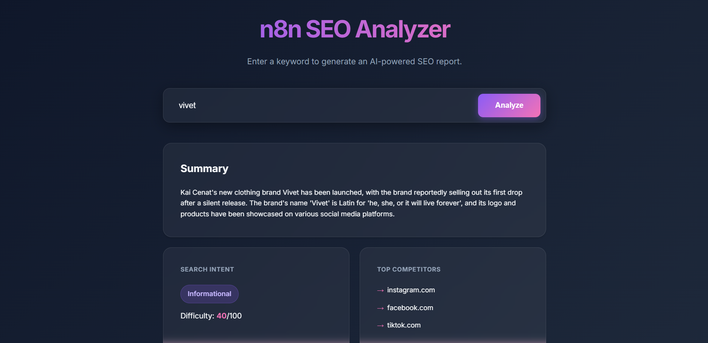
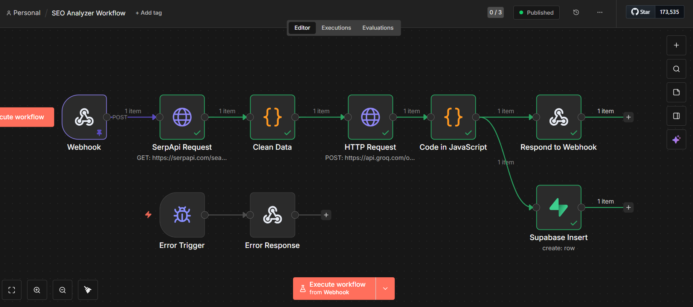
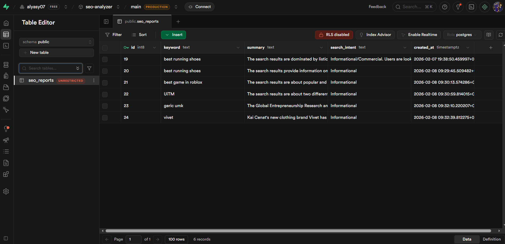

# n8n AI SEO Analyzer 🚀

A full-stack SEO analysis tool that automates keyword research using **n8n**, **Groq (Llama 3)**, and **SerpApi**.



## ⚙️ Workflow Logic

*The automated flow: Webhook → SerpApi → Data Cleaning → Groq AI → Supabase*

## 🌟 Features
*   **Live SERP Data**: Fetches top 10 Google results using SerpApi.
*   **AI Analysis**: Uses **Groq (Llama 3)** to determine Search Intent (Informational/Commercial) and calculate a Difficulty Score.
*   **Competitor Extraction**: Identifies top domain competitors automatically.
*   **Database Archiving**: Saves all reports to a Supabase (PostgreSQL) database.
*   **Modern UI**: Responsive frontend with glassmorphism design.

## 🛠️ Tech Stack
*   **Workflow Automation**: [n8n](https://n8n.io/)
*   **AI Model**: Groq (Llama 3 70B)
*   **Data Source**: SerpApi (Google Search Engine Results)
*   **Database**: Supabase
*   **Frontend**: HTML5, CSS3 (Glassmorphism), Vanilla JavaScript

## 🗄️ Database Schema

*Archived SEO reports in Supabase*

## 📂 Project Structure
```
├── frontend/
│   ├── index.html      # Main user interface
│   ├── style.css       # Premium dark-mode styling
│   └── script.js       # API communication & DOM manipulation
├── workflow.json       # n8n Workflow export
└── README.md           # This file
```

## 🚀 How to Run Locally

### 1. Backend (n8n)
1.  Install n8n (`npm install n8n -g`) or sign up for n8n Cloud.
2.  Import `workflow.json` into your n8n editor.
3.  Configure Credentials:
    *   **SerpApi**: Get a free key from serpapi.com and set `SERPAPI_KEY` in n8n (or replace directly in the node).
    *   **Groq API**: Get a free key from [console.groq.com](https://console.groq.com/).
        *   **Important**: You must set an environment variable `GROQ_API_KEY` in your n8n instance, or manually paste the key into the "Authorization" header in the *AI Analysis* node (replacing `{{$env.GROQ_API_KEY}}`).
    *   **Supabase**: Create a project and table `seo_reports`.

4.  Activate the workflow.

### 2. Frontend
1.  Open `frontend/script.js` and replace `N8N_WEBHOOK_URL` with your active n8n webhook ID.
2.  Serve the frontend:
    ```bash
    cd frontend
    npx http-server
    ```
3.  Open `http://127.0.0.1:8080`.

